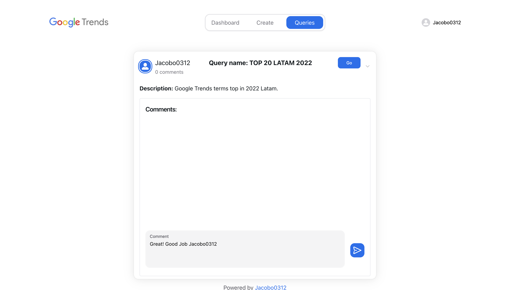

# User Guide for Google Trends Query Builder

In this user guide, you will learn how to use the Google Trends Query Builder, a tool for creating queries in Google's database for the most searched terms.

### Login

To start, log in by entering your username only.

After logging in, you have access to 3 tabs: dashboard, create, and queries. You can also log out by clicking on your username in the upper-left corner.

### Dashboard

On the dashboard tab, you will find 4 different tops with a limit of 25 to view Google Trends from the last two weeks.

### Create

On the create tab, you can customize your queries by adding different filters.

Let's try creating a query for the top trends in Latin America.

After selecting all the filters, click on "Run" to generate the graphs.

Now, let's save the query.

### Queries

In the queries tab, you can see all the queries saved by users.

You can also add comments.

### Top Miami

Now, let's create a top for the Miami region.

Add a comment.

By clicking on "GO," you can edit that query.

Finally, you can log out here.

